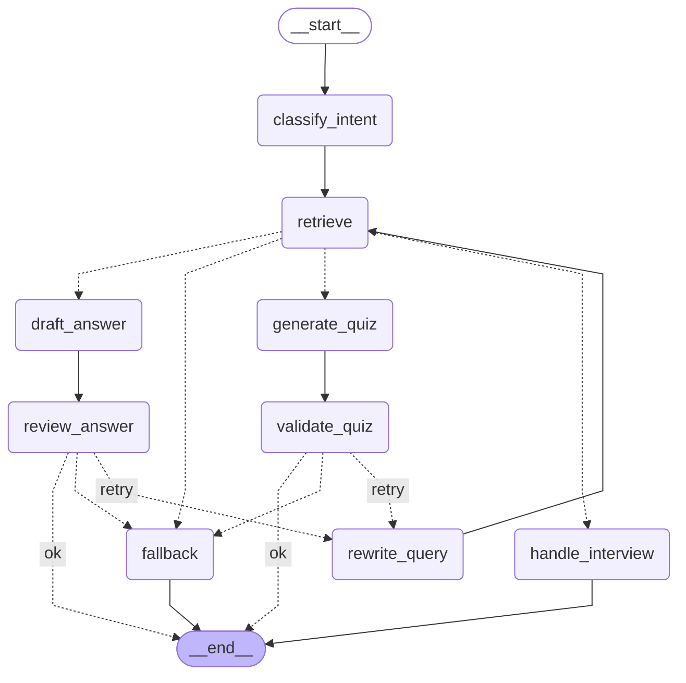

# StudyBuddy LangGraph Workflow Architecture

```mermaid
---
config:
  flowchart:
    curve: linear
---
graph TD;
	__start__([<p>__start__</p>]):::first
	classify_intent(classify_intent)
	retrieve(retrieve)
	draft_answer(draft_answer)
	review_answer(review_answer)
	generate_quiz(generate_quiz)
	validate_quiz(validate_quiz)
	handle_interview(handle_interview)
	rewrite_query(rewrite_query)
	fallback(fallback)
	__end__([<p>__end__</p>]):::last
	__start__ --> classify_intent;
	classify_intent --> retrieve;
	draft_answer --> review_answer;
	generate_quiz --> validate_quiz;
	retrieve -.-> draft_answer;
	retrieve -.-> fallback;
	retrieve -.-> generate_quiz;
	retrieve -.-> handle_interview;
	review_answer -. &nbsp;ok&nbsp; .-> __end__;
	review_answer -.-> fallback;
	review_answer -. &nbsp;retry&nbsp; .-> rewrite_query;
	rewrite_query --> retrieve;
	validate_quiz -. &nbsp;ok&nbsp; .-> __end__;
	validate_quiz -.-> fallback;
	validate_quiz -. &nbsp;retry&nbsp; .-> rewrite_query;
	fallback --> __end__;
	handle_interview --> __end__;
	classDef default fill:#f2f0ff,line-height:1.2
	classDef first fill-opacity:0
	classDef last fill:#bfb6fc

```
